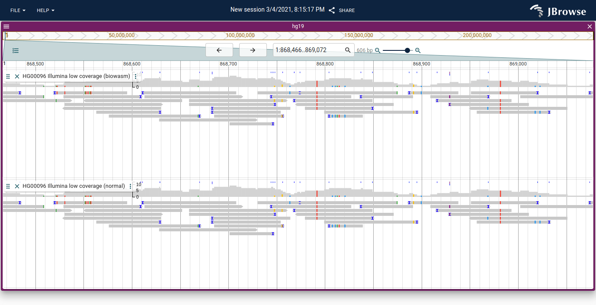

# jbrowse-plugin-biowasm

This uses @biowasm/aioli to parse BAM files. The emscripten code can "mount"
remote files to the emscripten filesystem. Once this is done, we can run
samtools view to generate a 1-to-1 comparison with our normal JS code. Note
that the aioli code doesn't provide any speedup here and is a bit slower, but
hypothetically could hook into some samtools functionality if needed

## Notes

Also see https://github.com/cmdcolin/aioli_demo
